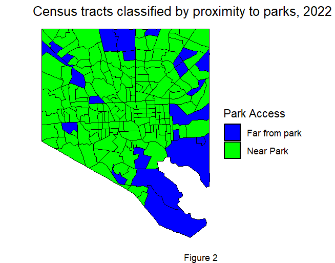

# Analyzing Urban Green Space Accessibility and Demographics in Baltimore

## Overview

This project analyzes park accessibility in Baltimore and its relationship with demographics such as population density, race, and income. Uneven park access could be due to factors such as economic disparities, urban development patterns or other decisions, have resulted in uneven park access, which is vital for physical, mental, and social well-being. Walkability and demographic analysis can identify access gaps and inform strategies for equitable green spaces.

Date of data collection: 2024-11-05

Geographic location of data collection: 
Baltimore County, Maryland, United States of America

#### Creator: 
- Author/Principal Investigator Information
- Name: Krishna Chaitanya Mummadi
- ORCID:https://orcid.org/0009-0008-6832-0349
- Institution: University of Maryland Baltimore County
- Address: 1000 Hilltop Circle, Baltimore, MD 21250
- Email: mt68291@umbc.edu, kcm59267@gmail.com

## Goals

- Assess park accessibility in Baltimore's census tracts based on proximity and coverage.
- Analyze disparities in park access by race, income, and population density.
- Identify tracts without parks and calculate park-to-tract area ratios.
- Perform isochrone analysis for park accessibility via walking, cycling, and driving.
- Utilize Leaflet and ggplot2 for advanced mapping and interactive visualizations.

### Methodological Information

##### Data collection: 

- Baltimore Boundary: Extracted using the Tigris package, which provides - tract-level geographic and demographic shapefiles.
- Parks Data: Obtained in GeoJSON format from Open Baltimore, providing details on park locations and characteristics.
- Demographic Data: Collected from the American Community Survey (ACS) 2022 dataset using the TidyCensus package and API. Variables included population, race, and median income data for Baltimore census tracts.
- Isochrone Data: Generated using OpenRouteService API, which calculated 5, 10 and 15-minute isochrones for various travel modes (walking, cycling, and driving) around selected parks and custom locations.

##### Processing the data: 

- Spatial Transformations: Data were transformed to appropriate coordinate systems (CRS 3857 for spatial analysis; CRS 4326 for OpenRouteService compatibility).
- Proximity Analysis: Census tract centroids were calculated and classified based on their distance to parks (threshold of 800 meters).
- Park-Tract Intersections: Tracts without park intersections were identified using st_intersects from the sf package.
- Demographic Calculations: Percentages of Black and White populations and median income were calculated for each tract.
- Isochrone Calculations: Isochrones were retrieved for walking, cycling, and driving using OpenRouteService, cropped and simplified to improve visualization.
- Visualization: Used ggplot2, Leaflet, and MapView for interactive and static maps, and scale_fill_manual for custom legends.

##### Standards and calibration information

- CRS 3857 (Web Mercator) for internal analysis.
- CRS 4326 (WGS 84) for compatibility with OpenRouteService.

##### Quality-assurance procedures performed on the data:

- Ensured data consistency by filtering for relevant variables (e.g., total population, median income).
- Transformed park geometries to CRS 4326 for compatibility with isochrone calculations and ensured proper alignment
- Ensured spatial intersections between parks and tracts were used firstly using st_intersection, then joined Using left_join between tract and park data to prevent creating multiple rows for the same tract.
- Created focused views of specific parks (e.g., Park-75) by isolating and transforming data for better zoom and interaction in Leaflet maps.
- Cropped and simplified overlapping polygons to ensure accurate display of isochrone data, allowing individual attributes to be shown without overlap conflicts in interactive maps.

## Data & File overview

Accessibility_final_project_files/figure-pptx -
Contains images of plots and maps used in the final project presentation (PPT).

Map_images/ -
Contains static images of Leaflet maps to showcase in the analysis.

R/ -
Contains functions.R, which includes all functions used in the project.

.gitignore - 
System-generated file for version control; not directly used in the analysis.

Census tracts classified by proximity to parks.png
A PNG image showing analysis results of census tracts classified by their proximity to parks.

Isochrone_park_tract.png - 
Another PNG image showing results from Leaflet map analysis.

Maps_for_README.R - 
Code for converting Leaflet maps to static maps and HTML maps for inclusion in the README file.

README.Rmd -
A Markdown file containing the previous version of the README documentation.

README.html -
The HTML-rendered version of the README.

References_fp.bib -
The BibTeX file containing references used in the project.

final_project_PPT.pptx -
The final PowerPoint presentation of the project.

final_project_PPT.qmd -
A Quarto Markdown file used to prepare and render the PowerPoint presentation.

finalproject.html -
HTML file of the final project output.

finalproject.qmd -
Quarto Markdown file containing the code and narrative for the final project.

functions.R -
R script file added recently containing new functions developed for the project.

leaflet_map_park75.html -
HTML file of a Leaflet map showing analysis for Park 75.

map_cycle.html, map_drive.html, map_walk.html -
HTML files of interactive Leaflet maps for cycling, driving, and walking analyses.

## Maps of Parks in Baltimore

Tracts near to the park

Tracts with no parks

This map visualizes isochrones, parks, and tracts to highlight accessibility within walking distances

Isochrone Analysis: Accessibility varies significantly by travel mode (walking, cycling, driving), with walking showing the smallest coverage area.

The image showing isochrones of Park-75:   

[Interactive Map: Park-75](leaflet_map_park75.html) < Leaflet Interactive map link

Explore the accessibility of parks of a selected location(lon = -76.601798751124, lat = 39.29971352538098) in 3 intervals  using different travel modes:

Foot Walking:  
 
  

Cycling: 
  
  

Driving Car:  
 
  

## Data Sources &  Acknowledgements

##### Licenses/restrictions placed on the data: 

This project is licensed under the MIT License. See the [LICENSE.md](LICENSE.md) file for more details

##### Links to publications that cite or use the data: 
- Buckley, Geoffrey. 2009. “Parks and People: An Environmental Justice Inquiry in Baltimore, Maryland.” January. - - -   https://www.academia.edu/61786724/Parks_and_people_An_environmental_justice_inquiry_in_Baltimore_Maryland.
- “Spatial Disparities in the Distribution of Parks and Green Spaces in the USA Annals of Behavioral Medicine.” n.d. https://link.springer.com/article/10.1007/s12160-012-9426-x?utm_source.
- “Park Dataset.” n.d. https://data.baltimorecity.gov/datasets/baltimore::parks-1/about.

##### Data derived from another source?
If yes, list source(s): 
- Tigris Package: Used to obtain the Baltimore City geographic boundary shapefiles.
- American Community Survey (ACS) 2022: Used for demographic data analysis, including population characteristics.
- Parks Data from Open Baltimore: Accessed public parks and recreation-related datasets.

##### Recommended citation for this dataset: 
- Accessibility in Parks and Recreational Areas Under ADA - KNOW-THE-ADA. n.d. https://know-the-ada.com/accessibility-in-parks-and-recreational-areas-under-ada/?utm_source.
- “Chatgpt_promt.” n.d. Write a code snippet to filter tracts without parks using the st_intersects object (intersections_p_t), where intersections_p_t represents the spatial intersections between census tracts (balt_trct_pop22) and parks (ob_park).
- “Create Your Own Discrete Scale Scale_manual.” n.d. https://ggplot2.tidyverse.org/reference/scale_manual.html.
- “Milos-Agathon/Isochrone_maps: In This Repo, I Will Show You How to Create Interactive and Static Isochrone Maps in R Using Openrouteservice, Leaflet, and Ggplot2.” n.d. https://github.com/milos-agathon/isochrone_maps.
- “Openrouteservice Goes R Openrouteservice.” 2018. https://openrouteservice.org/openrouteservice-r-package/.
- “Park Dataset.” n.d. https://data.baltimorecity.gov/datasets/baltimore::parks-1/about.
- “Urban Spatial. Urban Spatial.” n.d. Accessed December 20, 2024. https://urbanspatialanalysis.com/does-your-city-have-equitable-park-access/.

#### Data-Specific Information for: [balt_trct_pop22]

Number of variables: 
11

Number of cases/rows: 
199

##### Variable List: 
- GEOID: Unique identifier for each census tract (string).
- NAME: Name of the census tract (string).
- variable: Indicates the type of population data; for this dataset, it is "Total Population" (string).
- estimate: Population estimate for 2022 (integer).
- moe: Margin of error for the population estimate (numeric).
- geometry: Spatial geometry for census tract boundaries (polygon).
- distance_type: Classification of tracts by proximity to parks ("Near Park" or "Far from Park").
- area_sq_km: Area of each census tract in square kilometers, calculated as st_area(balt_trct_pop22) / 10^6.
- pop_density: Population density (people per square kilometer), calculated as estimate / area_sq_km.
- percent_white: Percentage of White residents in the tract
- percent_black: Percentage of Black residents in the tract 

#### Limitations

Modifiable Areal Unit Problem: Analysis is based on census tracts, which may not fully represent the socio-political  factors influencing green space access.
Focus on Proximity: The study emphasizes proximity and walkability, other factors like park quality or amenities are not involved in this project.

#### Key Results

Tracts near parks have higher population density (2599 vs. 1694 people/km²).
Black residents generally have better park proximity than White residents.
35 of 199 tracts lack parks, revealing significant access gaps.
Walking shows the smallest park coverage compared to cycling and driving.
Park proximity correlates with racial demographics but not median income.
Isochrone analysis highlights accessibility variations by travel mode and time.
Insights can guide equitable urban planning for improved park access.

## Conclusion

This project examines disparities in Baltimore's park distribution, revealing that central areas feature smaller, more accessible parks, while northern and southern areas have fewer, larger parks, with some tracts lacking any parks entirely. Black communities tend to have better access to parks, but the smaller size of these parks can limit their usability. Isochrone analysis provides valuable insights into accessibility across different travel modes, highlighting gaps and opportunities for improvement. By combining data-driven analysis with community input, this research seeks to promote equitable access to parks and thoughtful urban development that benefits all residents.
